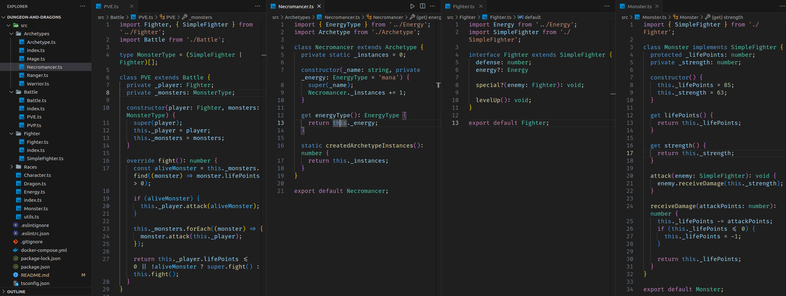

# README: Dungeons and Dragons



## Project Description

This is a project where I apply the principles of SOLID architecture and Object-Oriented Programming (OOP) in a structure for a role-playing game.

### Technologies

- LINUX
- VSCODE
- NODE.JS
- TYPESCRIPT


### What I Learned

- How to implement classes and interfaces following best practices guided by SOLID and OOP.
- How to transform ideas into a code structure and, with that, initiate new projects.

## How to Run the Project

1. Clone the repository:

   ```bash
   git clone https://github.com/feduarte-dev/dungeon-and-drangons
   ```

2. Navigate to the project directory:

   ```bash
   cd your-repository
   ```

3. Initiate the containers

   ```bash
   docker-compose up -d
   docker exec -it trybers_and_dragons bash
   ```
   
4. Install dependencies inside container:

   ```bash
   npm install
   ```

5. If you want to run application:

   ```bash
   npm run dev
   ```

## Contributions

[Felipe](https://www.linkedin.com/in/feduarte-dev/) - /src

[Trybe](https://www.betrybe.com/) - Everything else
